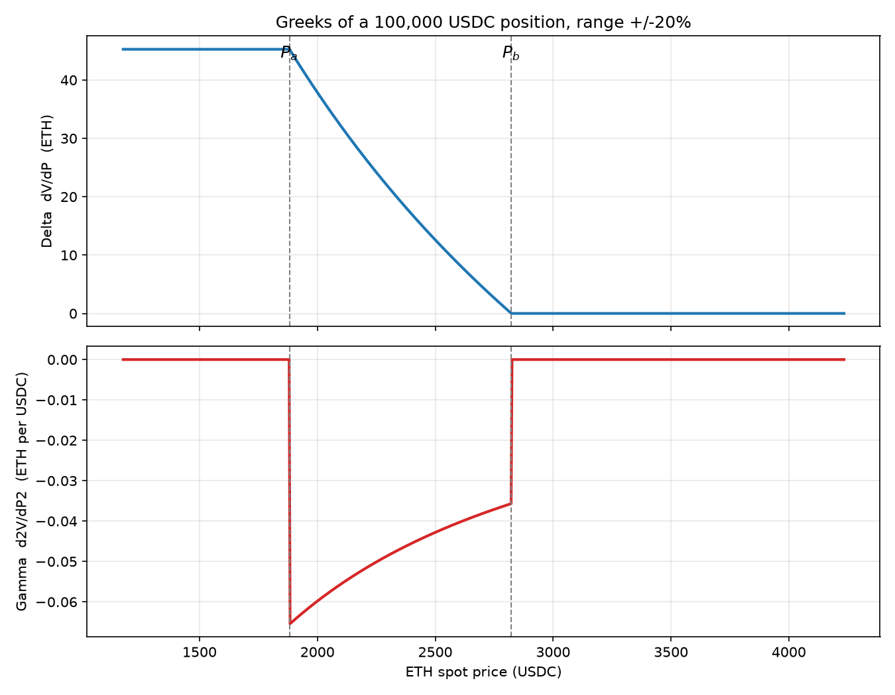
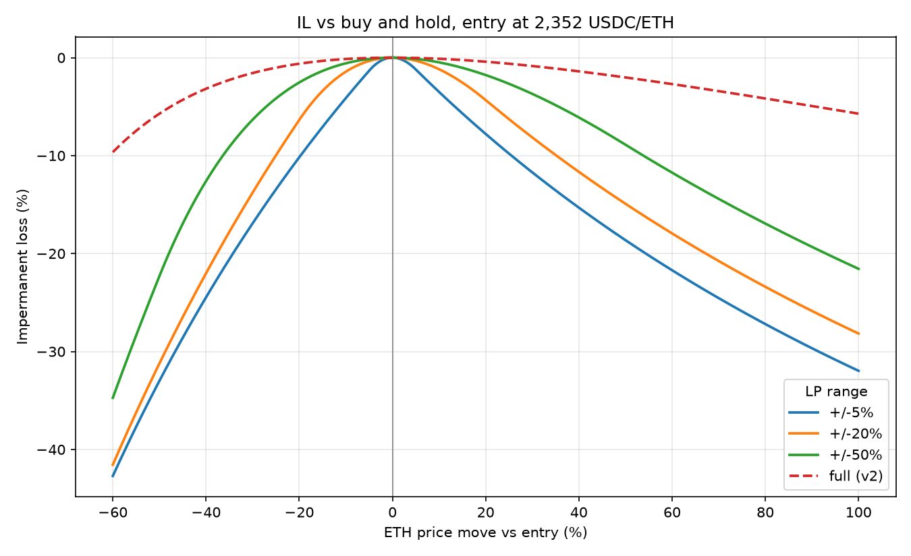
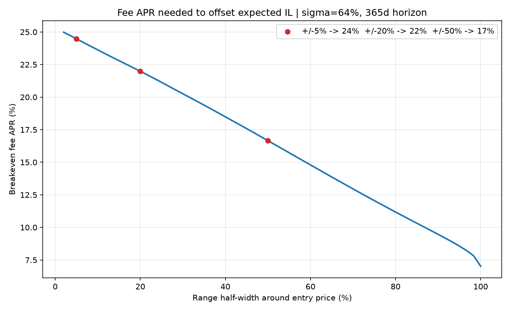
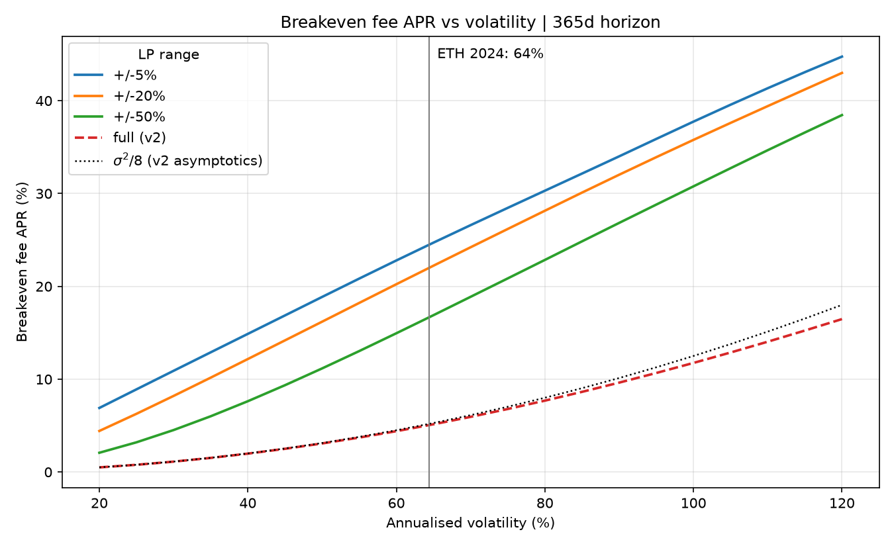
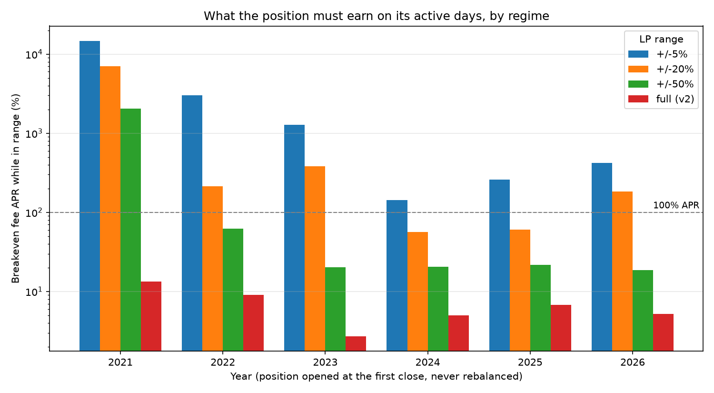

# uniswap-v3-lp-risk

[](https://github.com/claudio1923/uniswap-v3-lp-risk/actions/workflows/tests.yml)

Quantitative risk analysis of a concentrated liquidity position on Uniswap v3, ETH/USDC pair.

## In short

Providing liquidity on Uniswap v3 is a short volatility trade. The pool sells your ETH as the price rises and buys it back as it falls, so the position always ends up worth less than simply holding the two assets — the *impermanent loss*. Fees are the compensation. **This repository computes how large those fees have to be.**

The catch that most back-of-envelope answers miss: a concentrated position earns nothing while the price sits outside its range, but keeps losing. Correcting for that multiplies the answer by 2.6 for a ±20% band, and by almost six for a ±5% one.

ETH/USDC in 2024, 100,000 USDC deposited on 1 January and never rebalanced:

| LP range | days in range | fee APR needed **on active days** | verdict |
|---|---|---|---|
| ±5% | 17.2% | **142.0%** | not viable |
| ±20% | 38.8% | **56.6%** | demanding |
| ±50% | 81.4% | **20.4%** | plausible |
| full range (v2) | 100.0% | **5.0%** | easy, but earns little |

Repeated across 2021–2026, the direction of the market turns out to be irrelevant — but so is volatility, which is the input every standard model uses. Ranking six years, realised volatility correlates with the required fee APR at $\rho = 0.37$; the ratio of net price displacement to volatility correlates at $\rho = 0.83$. **The quiet year, 2023, was the worst one to be concentrated in.**

Everything below derives these numbers from closed-form position math, checks that math against two independent analytic limits, and states plainly what the model leaves out.

## The question

Given an LP position in a price range $[P_a, P_b]$:

1. what is the **impermanent loss** relative to simply holding the same two assets?
2. what **minimum fee APR** makes the position worth taking versus buy & hold?

Concentrated liquidity is the defining feature of Uniswap v3: narrowing the range multiplies the fees earned per unit of capital, but it multiplies the loss just as hard when the price moves. This project quantifies that trade-off.

## Method

### Position accounting

With $P$ the spot price (USDC per ETH), $L$ the liquidity and $[P_a, P_b]$ the range, the token balances are:

$$
x = L\left(\frac{1}{\sqrt{P}} - \frac{1}{\sqrt{P_b}}\right), \qquad
y = L\left(\sqrt{P} - \sqrt{P_a}\right) \qquad \text{if } P_a \le P \le P_b
$$

$$
P < P_a: \quad x = L\left(\frac{1}{\sqrt{P_a}} - \frac{1}{\sqrt{P_b}}\right),\ y = 0
\qquad\qquad
P > P_b: \quad x = 0,\ y = L\left(\sqrt{P_b} - \sqrt{P_a}\right)
$$

Outside the range the position holds a single asset: all ETH below $P_a$, all USDC above $P_b$. That is the mechanism generating the loss — the pool sells ETH on the way up and buys it back on the way down, always on the wrong side of the move.

The position value in USDC is $V = xP + y$.

### Impermanent loss

Depositing $(x_0, y_0)$ at price $P_0$ pins down $L$; the same basket is the buy & hold benchmark:

$$
\text{IL}(P) = \frac{V_{\text{LP}}(P)}{V_{\text{hold}}(P)} - 1
= \frac{x(P)\,P + y(P)}{x_0 P + y_0} - 1
$$

The full-range Uniswap v2 case is recovered as $P_a \to 0$, $P_b \to \infty$ and has a closed form in $k = P/P_0$:

$$
\text{IL}_{v2}(k) = \frac{2\sqrt{k}}{1+k} - 1
$$

Written in $X = \ln(P/P_0)$ this collapses to a single hyperbolic function:

$$
\text{IL} = \operatorname{sech}(X/2) - 1
$$

since $2\sqrt{k}/(1+k) = 2/(e^{-X/2} + e^{X/2})$. The form is worth keeping because the expansion $\operatorname{sech}(u) \approx 1 - u^2/2$ then gives the whole small-move behaviour in one line:

$$
\text{IL} \approx -\frac{X^2}{8}
$$

The loss is quadratic in the log price move, and everything below follows from it.

This identity is checked numerically by the test suite in `tests/`: with $P_a = 0$ and $P_b = \infty$ the two formulas agree to within $10^{-12}$.

### Greeks

Substituting $x$ and $y$ into the value gives, inside the range,

$$
V(P) = L\left(2\sqrt{P} - \frac{P}{\sqrt{P_b}} - \sqrt{P_a}\right)
$$

and differentiating twice:

$$
\Delta = \frac{\partial V}{\partial P} = L\left(\frac{1}{\sqrt P} - \frac{1}{\sqrt{P_b}}\right) = x
\qquad\qquad
\Gamma = \frac{\partial^2 V}{\partial P^2} = -\frac{L}{2P^{3/2}} < 0
$$

Two results worth stating explicitly.

**The delta equals the ETH balance**, and not only inside the range: below $P_a$ the position is a flat ETH holding, above $P_b$ it is pure USDC and both the delta and $x$ are zero. It holds in all three regimes because $V$ is linear in $P$ at fixed composition.

**The gamma is strictly negative in range and exactly zero outside.** The payoff is $C^1$ but not $C^2$: the delta is continuous at both bounds — the tests verify that its one-sided gap vanishes linearly — while the gamma jumps.



This is the framing that makes the rest of the project legible. **Short gamma while collecting fees is a sold straddle**, with the fee APR in the role of theta. The breakeven computed below is therefore the classic condition *theta collected $\ge$ cost of gamma*, written for a payoff whose gamma happens to switch off outside a band.

### Loss-versus-rebalancing

Impermanent loss is a terminal quantity: it compares two portfolios at a single future price and says nothing about the road taken. The sharper modern measure is **loss-versus-rebalancing** — the rate at which the pool leaks value to arbitrageurs, relative to a strategy holding the same instantaneous exposure at market prices ([Milionis, Moallemi, Roughgarden and Wan, 2022](https://arxiv.org/abs/2208.06046)).

Under the same GBM it is driven entirely by curvature, which means the gamma above already contains it:

$$
\text{LVR} = \frac{\sigma^2 P^2}{2}\,\bigl(-\Gamma\bigr)
$$

Two consequences follow directly, and both are checked in `tests/test_lvr.py`.

**The full-range case is exactly $\sigma^2/8$ of position value per year** — the constant-product result, and the same number the breakeven quadrature converges to as $\sigma \to 0$. Two independent routes, one closed form in the curvature and one numerical integration of the terminal loss, meeting on the same constant.

**Absolute LVR does not depend on the range bounds at all.** Same liquidity, same gamma, same leak in USDC per year. What narrowing does is shrink the capital that leak is charged against, and the ratio is the concentration multiplier — at ETH's realised 64.4% volatility:

| LP range | LVR yield | multiplier on $\sigma^2/8$ |
|---|---|---|
| ±5% | 209.7% | **40.5×** |
| ±20% | 53.8% | **10.4×** |
| ±50% | 21.8% | **4.2×** |
| full range (v2) | 5.2% | 1.0× |

And because $\Gamma$ is identically zero outside the band, so is LVR. **A concentrated position stops bleeding to arbitrage at the same instant it stops collecting fees** — the two sides of the ledger switch off together. That symmetry is what the in-range correction earlier in this README is measuring from the other direction.

### Breakeven fee APR

The price is assumed to follow a driftless geometric Brownian motion:

$$
P_T = P_0 \exp\left(-\tfrac{1}{2}\sigma^2 T + \sigma\sqrt{T}\,Z\right), \qquad Z \sim \mathcal{N}(0,1)
$$

so that $\mathbb{E}[P_T] = P_0$: no directional view, only volatility matters. The breakeven fee APR is the fee income that exactly cancels the expected loss:

$$
\text{APR}^{*} = -\frac{\mathbb{E}\left[\text{IL}(P_T)\right]}{T}, \qquad T = \frac{\text{horizon days}}{365}
$$

The concentrated payoff has no tractable closed-form integral, so $\mathbb{E}[\text{IL}]$ is evaluated by 128-node Gauss-Hermite quadrature — deterministic, no Monte Carlo sampling.

Taking the expectation of $-X^2/8$ under the GBM, where $\mathbb{E}[X^2] = \sigma^2 T$ to leading order, gives a closed form for the full-range case:

$$
\mathbb{E}[\text{IL}] \approx -\frac{\sigma^2 T}{8} \qquad\Longrightarrow\qquad \text{APR}^{*} \approx \frac{\sigma^2}{8}
$$

This is a second consistency check, independent of the v2 limit: the quadrature must reproduce the asymptotics where the expansion is valid, and drift away from it where it is not. It does, and the relative error shrinks with $\sigma$ exactly as an asymptotic result requires:

| $\sigma$ | quadrature | $\sigma^2/8$ | relative error |
|---|---|---|---|
| 10% | 0.1249% | 0.1250% | 0.06% |
| 20% | 0.4988% | 0.5000% | 0.25% |
| 40% | 1.9801% | 2.0000% | 0.99% |
| 80% | 7.6884% | 8.0000% | 3.90% |

At the 64.4% realised volatility of ETH in 2024 the quadrature gives 5.05% against 5.18% for the approximation — a 2.6% gap, which is the expansion failing, not the integrator.

## Data

Daily ETH-USD closes for 2024 via `yfinance`, 366 observations; the regime study below extends the same source back to 2021. If the source is unreachable, `analysis.py` falls back to a synthetic GBM series at $\sigma = 60$% and says so in the log.

| | |
|---|---|
| Entry price (2024-01-01) | 2,352 USDC/ETH |
| Final price (2024-12-31) | 3,333 USDC/ETH |
| Period return | +41.7% |
| Low / high | 2,211 / 4,066 |
| Realised annualised volatility | 64.4% |
| Simulated capital | 100,000 USDC |

## Results

### Price scenarios, ±20% range

| scenario | price | LP value | hold value | IL % | IL USDC |
|---|---|---|---|---|---|
| −60% | 941 | 42,587 | 72,871 | −41.56% | −30,285 |
| −35% | 1,529 | 69,203 | 84,175 | −17.79% | −14,972 |
| −15% | 1,999 | 90,057 | 93,218 | −3.39% | −3,161 |
| 0% | 2,352 | 100,000 | 100,000 | 0.00% | 0 |
| +15% | 2,705 | 104,063 | 106,782 | −2.55% | −2,719 |
| +35% | 3,176 | 104,315 | 115,825 | −9.94% | −11,510 |
| +60% | 3,764 | 104,315 | 127,129 | −17.94% | −22,813 |

The shock grid is deliberately staggered off the range bounds, so no scenario lands exactly on $P_a$ or $P_b$ and reports a boundary case as an interior one. At +15% the ±20% position is still inside its band and worth 104,063; from +35% on it is **frozen at 104,315** while buy and hold keeps climbing. At or above $P_b$ the position is entirely USDC and stops participating in the upside: the cap on gains is structural, not an artefact.

### Range width comparison

| range | IL −60% | IL −35% | IL −15% | IL +15% | IL +35% | IL +60% | days out of range | breakeven fee APR |
|---|---|---|---|---|---|---|---|---|
| ±5% | −42.70% | −20.58% | −7.07% | −5.69% | −13.55% | −21.70% | 82.8% | 24.5% |
| ±20% | −41.56% | −17.79% | −3.39% | −2.55% | −9.94% | −17.94% | 61.2% | 22.0% |
| ±50% | −34.73% | −9.11% | −1.36% | −1.04% | −4.85% | −11.74% | 18.6% | 16.7% |
| full range (v2) | −9.65% | −2.28% | −0.33% | −0.24% | −1.12% | −2.70% | 0.0% | 5.0% |



Concentration multiplies the loss: on a +60% move the ±5% range loses 21.7% against 2.7% for the full range, **eight times as much**. The dashed red curve is the v2 benchmark and is the lower envelope of all the others.

### Breakeven fee APR



The breakeven rises as the range tightens, but **far less than the loss does**. Going from ±50% to ±5%, the IL at +60% worsens by a factor of 1.8 while the breakeven only moves from 16.7% to 24.5%. The reason is that at $\sigma = 64$% over a year the price almost certainly leaves any range: the three curves converge towards the same fate.

### Volatility is the driver, not direction



Sweeping $\sigma$ from 20% to 120% at a fixed one-year horizon separates two regimes cleanly. The full-range curve tracks the $\sigma^2/8$ parabola and only peels away above roughly 80% volatility, where a quadratic stops describing a loss bounded below by −100%.

The concentrated curves sit far above it and are **less than quadratic**, increasingly so as the range tightens. Doubling volatility from 40% to 80% would multiply a quadratic breakeven by 4:

| range | $\sigma$ = 40% | $\sigma$ = 80% | ratio | $\sigma$ = 100% |
|---|---|---|---|---|
| ±5% | 14.88% | 30.30% | **2.04×** | 37.74% |
| ±20% | 12.17% | 28.15% | **2.31×** | 35.78% |
| ±50% | 7.63% | 22.85% | **3.00×** | 30.77% |
| full range (v2) | 1.98% | 7.69% | **3.88×** | 11.75% |

The full range recovers the quadratic law almost exactly. The tighter the band, the further from it — the ±5% range responds to volatility almost linearly.

The mechanism is saturation. Once the band is breached the position is fully converted to one asset and its loss can only grow as fast as the buy-and-hold benchmark it is measured against, so the expectation stops accelerating. Tightening the range buys a higher breakeven at low volatility and a flatter response at high volatility — the opposite of the intuition that a narrow range is uniformly more fragile to turbulence.

The vertical line marks ETH's realised 64.4% in 2024. Everything to the right of it is not exotic: a 100% volatility year pushes the ±20% breakeven from 22.0% to 35.8%.

### The correction that changes the conclusion

The breakeven above assumes fees accrue on the full position value for the entire horizon. That is false: **a concentrated position earns nothing while out of range**. Correcting for the fraction of 2024 actually spent in range:

| range | days in range | nominal breakeven | APR required **while in range** |
|---|---|---|---|
| ±5% | 17.2% | 24.5% | **142.0%** |
| ±20% | 38.8% | 22.0% | **56.6%** |
| ±50% | 81.4% | 16.7% | **20.4%** |
| full range (v2) | 100.0% | 5.0% | **5.0%** |

This is the practical answer to the research question. A ±5% ETH/USDC range in 2024 would have needed to yield over 140% annualised on its active days alone just to match buy & hold. The ±50% range gets away with 20.4%, the full range with 5.0%.

The correction is approximate: it uses the realised out-of-range frequency of 2024 as an estimate of the future, and it ignores that fee density is higher near the spot price — a narrow range, while in range, earns more than its share of capital. The two effects pull in opposite directions and do not obviously cancel; measuring them requires pool volume data, outside the scope of this work.

## Regimes: five years and a stub

The 2024 result rests on one price path. Repeating it on 2021 through 2026 turns a stated limitation into a test. Each year opens a fresh position at its own first close and holds it unrebalanced to 31 December, so the in-range share measures how long a static band survives that regime.

| year | days | return | vol | \|move\|/vol | ±5% in range | ±5% corr. | ±20% in range | ±20% corr. | ±50% in range | ±50% corr. | full corr. |
|---|---|---|---|---|---|---|---|---|---|---|---|
| 2021 | 365 | +404.2% | 107.4% | 1.51 | 0.3% | 14757.9% | 0.5% | 7023.6% | 1.6% | 2048.4% | 13.4% |
| 2022 | 365 | −68.3% | 87.2% | 1.32 | 1.1% | 3008.5% | 14.5% | 213.2% | 41.4% | 62.2% | 9.1% |
| 2023 | 365 | +90.0% | 46.4% | 1.38 | 1.4% | 1273.3% | 3.8% | 384.9% | 48.5% | 20.3% | 2.7% |
| 2024 | 366 | +41.7% | 64.4% | 0.54 | 17.2% | 142.0% | 38.8% | 56.6% | 81.4% | 20.4% | 5.0% |
| 2025 | 365 | −11.5% | 74.8% | 0.16 | 11.0% | 259.0% | 43.3% | 60.3% | 95.6% | 21.7% | 6.8% |
| 2026 | 234 | −19.2% | 65.3% | 0.33 | 7.3% | 424.2% | 14.5% | 183.6% | 100.0% | 18.7% | 5.2% |

*"corr." is the breakeven fee APR corrected for time in range: what the position must earn on the days it is actually earning.*

*2026 is a partial year. The study window is pinned in `CONFIG` to the last settled UTC day, 2026-08-22, so every figure in this table is exactly what `analysis.py` prints: ETH trades around the clock and an open day would keep moving the last row between runs.*



### The hypothesis, and how it failed

The natural claim is that narrow ranges are punished by *movement*, not *direction*, so years of opposite sign but similar turbulence should look alike. Half of it survives.

**Direction is indeed irrelevant.** Two rising years, 2021 and 2023, sit at 7023.6% and 384.9% for the ±20% band. Two falling years, 2022 and 2025, sit at 213.2% and 60.3%. Within each sign the spread is more than an order of magnitude: knowing which way the market went tells you nothing.

**But volatility does not explain the rest.** 2022 was nearly twice as volatile as 2023 — 87.2% against 46.4% — and yet its corrected breakeven was *lower*: 213% against 385%. The ordering by volatility and the ordering by corrected breakeven disagree almost everywhere.

Ranking the six years by each candidate statistic and correlating with the corrected breakeven (Spearman, computed in `analysis.py`):

| statistic | $\rho$ |
|---|---|
| realised volatility $\sigma$ | **+0.371** |
| $\lvert\ln(P_T/P_0)\rvert$ | **+0.771** |
| $\lvert\ln(P_T/P_0)\rvert / \sigma$ | **+0.829** |

Volatility alone is nearly uninformative. What predicts the outcome is net displacement measured against the noise — a trend-to-noise ratio. 2022 fell hard but thrashed on the way down and kept crossing back through its band; 2023 rose calmly and simply walked out of it. The quiet year was the worse one to be concentrated in.

This is not a subtlety of the estimate, it is structural. Under a driftless GBM the nominal breakeven is a function of $\sigma$ alone — direction cannot enter, by construction. The quantity that decides whether the position was worth holding is the time it spent in range, and that is governed by the path, which $\sigma$ does not summarise.

### What is actually viable

One number in the table is stable. The ±50% band required 20.3%, 20.4%, 21.7% and 18.7% across 2023, 2024, 2025 and 2026 — four years with returns from −19.2% to +90.0% and volatilities from 46% to 75%, all landing within three points of each other. Only 2021 and 2022, the two extreme regimes, break out of it.

The narrow bands never come close. In five of six years the ±5% range would have needed more than 250% annualised on its active days, and in 2021 it was in range for a single day out of 365 — at which point the figure stops being an APR and simply means the position was never alive.

Two caveats on all of this. Six observations of one asset is a sample, not a distribution, and the years are not independent draws from a stationary process. And the correction assumes fees accrue at a constant rate whenever the price is inside the band, which overstates how tradeable those active days really were.

## LIMITATIONS

The model does **not** capture:

- **Gas costs.** Opening, closing and collecting fees costs gas on Ethereum L1. On a small position it can exceed the impermanent loss itself. None of the figures above account for it.
- **Range rebalancing.** The analysis assumes a static position held for all of 2024. In practice an LP moves the range when the price runs away, crystallising the loss and paying gas every time. A ±5% range rebalanced weekly is a completely different product from the one modelled here.
- **Different fee tiers.** ETH/USDC exists across several pools (0.01%, 0.05%, 0.3%, 1%) with different depth and volume. The breakeven is expressed as a generic APR and is not tied to any specific tier.
- **MEV and transaction ordering.** Arbitrageurs realign the pool price to the market price and capture part of the value; the LP is on the losing side of every realignment (*loss-versus-rebalancing*). The classic IL model used here understates that cost.
- **Other LPs' liquidity concentration.** Fees earned depend on your share of the liquidity active at that tick, which changes continuously. Here the fee APR is an exogenous parameter, not an output of the model.
- **Path dependency.** Partly addressed above by repeating the study on 2021-2026, which is what exposed volatility as a poor predictor of the corrected breakeven. Six overlapping years of one asset is still a sample, not a distribution, and the regimes are not independent draws.
- **GBM as a price model.** Constant volatility, no jumps, no fat tails, no clustering. The expected breakeven is computed under this assumption and is optimistic to the extent that real ETH returns are leptokurtic.
- **Fee reinvestment and compounding.** The breakeven is a simple annualised return, with no compounding.

## Layout

```
uniswap-v3-lp-risk/
├── il_math.py          closed-form formulas, pure functions, no I/O
├── analysis.py         data, scenarios, tables, figures
├── tests/              pytest suite, network-free
├── requirements.txt    pinned dependency versions
├── LICENSE             MIT
├── README.md
└── figures/            il_vs_price.png, breakeven.png, greeks.png,
                        breakeven_vs_sigma.png, breakeven_by_year.png
```

## Running it

Self-consistency tests of the math, including the full-range limit and the
small-sigma asymptotics. They touch no network, so they run anywhere:

```bash
pytest -q
```

Full analysis: tables to the terminal, figures regenerated:

```bash
python analysis.py
```

Dependencies: `numpy`, `pandas`, `matplotlib`, `yfinance` (optional — without it the synthetic fallback is used).

## License

MIT. See [LICENSE](LICENSE).
